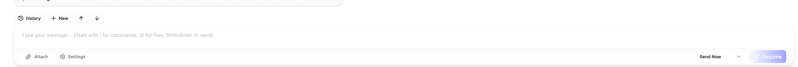
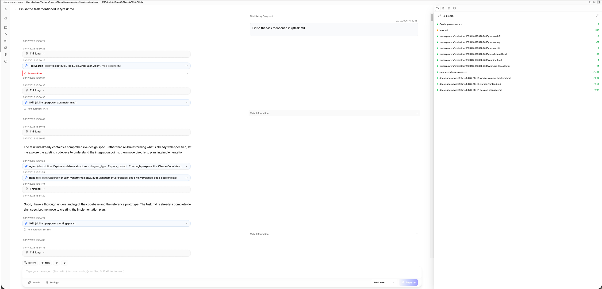

The card improvement should be improved. 
I want each card in the Session Grid should be resumed chat, I can direct send message and scroll up and down to see the past history interaction. Like  
So that I can track several concurrent project running parallelly. Also I can drag to change the position of the card, also change the size of the card for better visualization. The text inside the card should be wrapped. 

When I right mouse click the card, it will show something checking details. Then you can load the original CSS page not just the chat content but also 

